# Design Document

## Overview

FocusMate is a full-stack real-time virtual classroom platform that combines WebRTC video communication, AI-based attention monitoring, and browser-based focus enforcement. The system architecture follows a microservices-inspired approach with clear separation between the frontend (React), backend (FastAPI), AI engine (Python), and browser extension (Manifest V3).

The platform enables teachers to conduct live video sessions with up to 30 students simultaneously, while monitoring real-time attention metrics computed by an AI engine that analyzes facial features and behavior patterns. A browser extension enforces focus by preventing tab switching when LockMode is enabled.

## Architecture

### System Architecture

```mermaid
graph TB
    subgraph "Client Layer"
        FE[React Frontend<br/>Vite + Tailwind]
        EXT[Browser Extension<br/>Manifest V3]
    end
    
    subgraph "Backend Layer"
        API[FastAPI Server<br/>REST + WebSocket]
        AI[AI Engine<br/>Mediapipe + OpenCV]
    end
    
    subgraph "Data Layer"
        DB[(SQLite Database)]
    end
    
    subgraph "Communication Layer"
        WS[WebSocket Hub]
        RTC[WebRTC Signaling]
    end
    
    FE <-->|HTTP/WS| API
    FE <-->|WebRTC P2P| FE
    EXT <-->|WS| API
    AI -->|WS| API
    API <-->|SQL| DB
    API <--> WS
    API <--> RTC
    
    style FE fill:#1a1a2e
    style API fill:#16213e
    style AI fill:#0f3460
    style DB fill:#533483
```



### Technology Stack

**Frontend:**
- React 18 with TypeScript
- Vite for build tooling
- Tailwind CSS for styling
- WebRTC for peer-to-peer video
- Socket.io-client for real-time communication
- Zustand for state management
- React Router for navigation
- Chart.js for attention graphs

**Backend:**
- FastAPI (Python 3.10+)
- SQLAlchemy for ORM
- SQLite for database
- python-socketio for WebSocket
- python-jose for JWT
- passlib for password hashing
- Pydantic for validation

**AI Engine:**
- Python 3.10+
- Mediapipe for face mesh detection
- OpenCV for video processing
- NumPy for numerical computations
- WebSocket client for backend communication

**Browser Extension:**
- Manifest V3
- Vanilla JavaScript
- Chrome Extension APIs

**DevOps:**
- Docker and Docker Compose
- Nginx for reverse proxy (production)

### Deployment Architecture

```mermaid
graph LR
    subgraph "Docker Compose"
        NGINX[Nginx<br/>Reverse Proxy]
        FRONT[Frontend Container<br/>Port 5173]
        BACK[Backend Container<br/>Port 8000]
        AI_C[AI Engine Container<br/>Port 8001]
    end
    
    CLIENT[Client Browser] -->|HTTPS| NGINX
    NGINX -->|/api| BACK
    NGINX -->|/| FRONT
    BACK <--> AI_C
    
    style NGINX fill:#2d6a4f
    style FRONT fill:#1b4965
    style BACK fill:#62b6cb
    style AI_C fill:#bee9e8
```



## Components and Interfaces

### Frontend Components

#### 1. Authentication Module

**Components:**
- `LandingPage.tsx` - Hero section with branding and CTAs
- `LoginPage.tsx` - Email/password login with role selection
- `RegisterPage.tsx` - User registration form
- `AuthContext.tsx` - Authentication state management

**Interfaces:**
```typescript
interface User {
  id: string;
  email: string;
  role: 'teacher' | 'student';
  name: string;
}

interface AuthState {
  user: User | null;
  token: string | null;
  login: (email: string, password: string, role: string) => Promise<void>;
  register: (email: string, password: string, role: string, name: string) => Promise<void>;
  logout: () => void;
}
```

#### 2. Teacher Dashboard Module

**Components:**
- `TeacherDashboard.tsx` - Main dashboard container
- `SessionCreator.tsx` - Create session with room code generation
- `StudentGrid.tsx` - Responsive grid of student video tiles
- `StudentTile.tsx` - Individual student video with metrics
- `LiveActivityFeed.tsx` - Real-time event stream
- `LockModeToggle.tsx` - LockMode control switch
- `SessionAnalytics.tsx` - Live session statistics
- `TeacherReports.tsx` - Past session reports list
- `SessionReportDetail.tsx` - Detailed session report view

**Interfaces:**
```typescript
interface Session {
  id: string;
  roomCode: string;
  teacherId: string;
  startTime: Date;
  endTime?: Date;
  lockModeEnabled: boolean;
}

interface StudentMetrics {
  studentId: string;
  name: string;
  videoStream: MediaStream;
  attentionScore: number;
  status: 'Present' | 'Engaged' | 'Looking Away' | 'Drowsy' | 'Absent' | 'Left Class';
  isMuted: boolean;
  isCameraOff: boolean;
}

interface SessionReport {
  sessionId: string;
  date: Date;
  duration: number;
  students: StudentReport[];
}

interface StudentReport {
  studentId: string;
  name: string;
  finalAttentionScore: number;
  statusTimeline: StatusEvent[];
  tabSwitchCount: number;
  attendanceDuration: number;
}

interface StatusEvent {
  timestamp: Date;
  status: string;
  attentionScore: number;
}
```

#### 3. Student Classroom Module

**Components:**
- `StudentClassroom.tsx` - Main classroom container
- `VideoGrid.tsx` - Teacher and peer video displays
- `AttentionPanel.tsx` - Right panel with metrics and graph
- `BottomToolbar.tsx` - Mobile-optimized controls
- `StudentReports.tsx` - Personal reports list
- `StudentReportDetail.tsx` - Individual session report

**Interfaces:**
```typescript
interface ClassroomState {
  sessionId: string;
  teacherStream: MediaStream;
  peerStreams: Map<string, MediaStream>;
  myAttentionScore: number;
  myStatus: string;
  attentionHistory: AttentionDataPoint[];
  lockModeActive: boolean;
}

interface AttentionDataPoint {
  timestamp: Date;
  score: number;
}
```

#### 4. WebRTC Module

**Components:**
- `WebRTCManager.ts` - Manages peer connections
- `SignalingService.ts` - WebSocket signaling handler

**Interfaces:**
```typescript
interface PeerConnection {
  peerId: string;
  connection: RTCPeerConnection;
  stream: MediaStream;
}

interface SignalingMessage {
  type: 'offer' | 'answer' | 'ice-candidate' | 'join' | 'leave';
  from: string;
  to: string;
  payload: any;
}
```

#### 5. Responsive Layout System

**Breakpoints:**
- Mobile: < 640px
- Tablet: 640px - 1024px
- Desktop: > 1024px

**Grid Layouts:**
- 1 student: 1x1 (full width)
- 2-4 students: 2x2 grid
- 5-9 students: 3x3 grid
- 10-16 students: 4x4 grid
- 17+ students: Scrollable grid with 4 columns

**Mobile Optimizations:**
- Bottom toolbar: Fixed position with 60px height
- Right panel: Slide-in drawer with swipe gesture
- Video tiles: Minimum 150px width
- Touch targets: Minimum 44px

### Backend Components

#### 1. Authentication Service

**Endpoints:**
```python
POST /auth/register
POST /auth/login
GET /auth/me
POST /auth/refresh
```

**Models:**
```python
class User(Base):
    id: UUID
    email: str
    password_hash: str
    role: str  # 'teacher' or 'student'
    name: str
    created_at: datetime
```

#### 2. Room Service

**Endpoints:**
```python
POST /room/create
POST /room/join
POST /room/leave
GET /room/{room_id}/students
GET /room/{room_id}/teacher
PUT /room/{room_id}/lockmode
DELETE /room/{room_id}
```

**Models:**
```python
class Room(Base):
    id: UUID
    room_code: str  # 6-character unique code
    teacher_id: UUID
    start_time: datetime
    end_time: Optional[datetime]
    lock_mode_enabled: bool
    is_active: bool
```

#### 3. Attention Monitoring Service

**Models:**
```python
class AttentionSample(Base):
    id: UUID
    session_id: UUID
    student_id: UUID
    timestamp: datetime
    attention_score: float  # 0-100
    status: str
    
class StatusTimeline(Base):
    id: UUID
    session_id: UUID
    student_id: UUID
    timestamp: datetime
    previous_status: str
    new_status: str
    duration_in_previous: int  # seconds
```

#### 4. Tab Switch Tracking Service

**Models:**
```python
class TabSwitchEvent(Base):
    id: UUID
    session_id: UUID
    student_id: UUID
    timestamp: datetime
    lock_mode_active: bool
    was_blocked: bool
```

#### 5. Reporting Service

**Endpoints:**
```python
GET /reports/teacher/{teacher_id}/sessions
GET /reports/session/{session_id}
GET /reports/student/{student_id}/sessions
GET /reports/student/{student_id}/session/{session_id}
POST /reports/export/csv
POST /reports/export/pdf
```

**Models:**
```python
class ClassReport(Base):
    id: UUID
    session_id: UUID
    generated_at: datetime
    total_duration: int
    student_count: int
    average_attention: float
    report_data: JSON  # Comprehensive session data
```

#### 6. WebSocket Hub

**Events:**
```python
# Client -> Server
'join_session'
'leave_session'
'toggle_lockmode'
'mute_student'
'kick_student'
'ai_update'
'tab_switch'

# Server -> Client
'student_joined'
'student_left'
'lockmode_changed'
'attention_update'
'status_changed'
'student_muted'
'student_kicked'
'session_ended'
```

**Message Format:**
```python
class WebSocketMessage:
    event: str
    session_id: str
    user_id: str
    payload: dict
    timestamp: datetime
```

### AI Engine Components

#### 1. Face Detection Module

**Class: FaceDetector**
```python
class FaceDetector:
    def __init__(self):
        self.face_mesh = mp.solutions.face_mesh.FaceMesh(
            max_num_faces=1,
            refine_landmarks=True,
            min_detection_confidence=0.5,
            min_tracking_confidence=0.5
        )
    
    def detect_face(self, frame: np.ndarray) -> Optional[FaceLandmarks]:
        # Returns facial landmarks or None
        pass
```

#### 2. Attention Analyzer Module

**Class: AttentionAnalyzer**
```python
class AttentionAnalyzer:
    def analyze_engagement(self, landmarks: FaceLandmarks) -> tuple[float, str]:
        # Returns (attention_score, status)
        # Analyzes:
        # - Eye aspect ratio (EAR) for drowsiness
        # - Head pose for looking away
        # - Blink rate for engagement
        # - Face presence for absence detection
        pass
    
    def compute_attention_score(self, metrics: dict) -> float:
        # Weighted combination of engagement indicators
        # Returns 0-100
        pass
```

**Status Detection Logic:**
- **Present**: Face detected, neutral engagement
- **Engaged**: High attention score (>70), eyes open, facing forward
- **Looking Away**: Head pose angle > 30 degrees
- **Drowsy**: Low eye aspect ratio, slow blink rate
- **Absent**: No face detected for > 2 seconds
- **Left Class**: Absent status persists for > 10 seconds

#### 3. Video Stream Processor

**Class: StreamProcessor**
```python
class StreamProcessor:
    def __init__(self, student_id: str, session_id: str):
        self.student_id = student_id
        self.session_id = session_id
        self.detector = FaceDetector()
        self.analyzer = AttentionAnalyzer()
        self.ws_client = WebSocketClient()
        self.absent_timer = 0
        
    async def process_frame(self, frame: np.ndarray):
        landmarks = self.detector.detect_face(frame)
        
        if landmarks:
            score, status = self.analyzer.analyze_engagement(landmarks)
            self.absent_timer = 0
        else:
            self.absent_timer += 1
            if self.absent_timer > 60:  # 2 seconds at 30fps
                status = 'Absent'
                if self.absent_timer > 300:  # 10 seconds
                    status = 'Left Class'
            score = 0
        
        await self.ws_client.send_update({
            'student_id': self.student_id,
            'session_id': self.session_id,
            'attention_score': score,
            'status': status,
            'timestamp': datetime.now()
        })
```

### Browser Extension Components

#### 1. Background Service Worker

**File: background.js**
```javascript
// Listens for tab activation and switching
chrome.tabs.onActivated.addListener(handleTabSwitch);
chrome.tabs.onUpdated.addListener(handleTabUpdate);

// WebSocket connection to backend
let ws = null;
let lockModeEnabled = false;
let classroomTabId = null;

function handleTabSwitch(activeInfo) {
  if (lockModeEnabled && activeInfo.tabId !== classroomTabId) {
    // Block switch and refocus classroom
    chrome.tabs.update(classroomTabId, { active: true });
    logTabSwitchEvent(true); // blocked
  } else if (classroomTabId && activeInfo.tabId !== classroomTabId) {
    logTabSwitchEvent(false); // not blocked
  }
}
```

#### 2. Content Script

**File: content.js**
```javascript
// Injected into classroom page
// Receives LockMode state from backend
// Displays visual indicator

window.addEventListener('message', (event) => {
  if (event.data.type === 'LOCKMODE_UPDATE') {
    updateLockModeUI(event.data.enabled);
  }
});
```

#### 3. Popup UI

**File: popup.html**
```html
<div class="popup-container">
  <div class="logo">FocusMate</div>
  <div class="status">
    <span id="lockmode-status">LockMode: OFF</span>
  </div>
  <div class="info">
    LockMode is controlled by your teacher
  </div>
</div>
```

## Data Models

### Database Schema

```sql
-- Users table
CREATE TABLE users (
    id TEXT PRIMARY KEY,
    email TEXT UNIQUE NOT NULL,
    password_hash TEXT NOT NULL,
    role TEXT NOT NULL CHECK(role IN ('teacher', 'student')),
    name TEXT NOT NULL,
    created_at TIMESTAMP DEFAULT CURRENT_TIMESTAMP
);

-- Rooms table
CREATE TABLE rooms (
    id TEXT PRIMARY KEY,
    room_code TEXT UNIQUE NOT NULL,
    teacher_id TEXT NOT NULL,
    start_time TIMESTAMP NOT NULL,
    end_time TIMESTAMP,
    lock_mode_enabled BOOLEAN DEFAULT FALSE,
    is_active BOOLEAN DEFAULT TRUE,
    FOREIGN KEY (teacher_id) REFERENCES users(id)
);

-- Room participants table
CREATE TABLE room_participants (
    id TEXT PRIMARY KEY,
    room_id TEXT NOT NULL,
    student_id TEXT NOT NULL,
    joined_at TIMESTAMP NOT NULL,
    left_at TIMESTAMP,
    FOREIGN KEY (room_id) REFERENCES rooms(id),
    FOREIGN KEY (student_id) REFERENCES users(id)
);

-- Attention samples table
CREATE TABLE attention_samples (
    id TEXT PRIMARY KEY,
    session_id TEXT NOT NULL,
    student_id TEXT NOT NULL,
    timestamp TIMESTAMP NOT NULL,
    attention_score REAL NOT NULL,
    status TEXT NOT NULL,
    FOREIGN KEY (session_id) REFERENCES rooms(id),
    FOREIGN KEY (student_id) REFERENCES users(id)
);

-- Status timeline table
CREATE TABLE status_timeline (
    id TEXT PRIMARY KEY,
    session_id TEXT NOT NULL,
    student_id TEXT NOT NULL,
    timestamp TIMESTAMP NOT NULL,
    previous_status TEXT,
    new_status TEXT NOT NULL,
    duration_in_previous INTEGER,
    FOREIGN KEY (session_id) REFERENCES rooms(id),
    FOREIGN KEY (student_id) REFERENCES users(id)
);

-- Tab switch events table
CREATE TABLE tab_switch_events (
    id TEXT PRIMARY KEY,
    session_id TEXT NOT NULL,
    student_id TEXT NOT NULL,
    timestamp TIMESTAMP NOT NULL,
    lock_mode_active BOOLEAN NOT NULL,
    was_blocked BOOLEAN NOT NULL,
    FOREIGN KEY (session_id) REFERENCES rooms(id),
    FOREIGN KEY (student_id) REFERENCES users(id)
);

-- Class reports table
CREATE TABLE class_reports (
    id TEXT PRIMARY KEY,
    session_id TEXT NOT NULL,
    generated_at TIMESTAMP NOT NULL,
    total_duration INTEGER NOT NULL,
    student_count INTEGER NOT NULL,
    average_attention REAL NOT NULL,
    report_data TEXT NOT NULL,  -- JSON
    FOREIGN KEY (session_id) REFERENCES rooms(id)
);

-- Indexes for performance
CREATE INDEX idx_attention_session ON attention_samples(session_id);
CREATE INDEX idx_attention_student ON attention_samples(student_id);
CREATE INDEX idx_status_session ON status_timeline(session_id);
CREATE INDEX idx_tab_switch_session ON tab_switch_events(session_id);
CREATE INDEX idx_room_code ON rooms(room_code);
```

## Error Handling

### Frontend Error Handling

**Error Categories:**
1. **Network Errors**: Connection failures, timeouts
2. **Authentication Errors**: Invalid credentials, expired tokens
3. **WebRTC Errors**: Media device access, connection failures
4. **Validation Errors**: Invalid input, missing fields

**Error Handling Strategy:**
```typescript
class ErrorHandler {
  static handle(error: Error, context: string) {
    // Log to console in development
    if (import.meta.env.DEV) {
      console.error(`[${context}]`, error);
    }
    
    // Show user-friendly message
    if (error instanceof NetworkError) {
      toast.error('Connection lost. Retrying...');
      // Implement retry logic
    } else if (error instanceof AuthError) {
      toast.error('Session expired. Please login again.');
      // Redirect to login
    } else if (error instanceof WebRTCError) {
      toast.error('Camera/microphone access denied.');
      // Show instructions
    } else {
      toast.error('Something went wrong. Please try again.');
    }
  }
}
```

### Backend Error Handling

**HTTP Status Codes:**
- 200: Success
- 201: Created
- 400: Bad Request (validation errors)
- 401: Unauthorized (authentication required)
- 403: Forbidden (insufficient permissions)
- 404: Not Found
- 409: Conflict (duplicate resource)
- 500: Internal Server Error

**Error Response Format:**
```python
class ErrorResponse(BaseModel):
    error: str
    message: str
    details: Optional[dict] = None
    timestamp: datetime
```

**Exception Handlers:**
```python
@app.exception_handler(ValidationError)
async def validation_exception_handler(request, exc):
    return JSONResponse(
        status_code=400,
        content={
            "error": "ValidationError",
            "message": "Invalid input data",
            "details": exc.errors()
        }
    )

@app.exception_handler(AuthenticationError)
async def auth_exception_handler(request, exc):
    return JSONResponse(
        status_code=401,
        content={
            "error": "AuthenticationError",
            "message": str(exc)
        }
    )
```

### AI Engine Error Handling

**Error Scenarios:**
1. **Camera Access Failure**: Retry with exponential backoff
2. **Face Detection Failure**: Continue processing, mark as Absent
3. **WebSocket Disconnection**: Reconnect automatically
4. **Frame Processing Timeout**: Skip frame, continue with next

**Recovery Strategy:**
```python
class AIErrorHandler:
    @staticmethod
    async def handle_camera_error(error: Exception):
        logger.error(f"Camera error: {error}")
        await asyncio.sleep(5)  # Wait before retry
        # Attempt to reinitialize camera
    
    @staticmethod
    async def handle_websocket_error(error: Exception):
        logger.error(f"WebSocket error: {error}")
        # Reconnect with exponential backoff
        for attempt in range(5):
            await asyncio.sleep(2 ** attempt)
            if await reconnect():
                break
```

## Testing Strategy

*A property is a characteristic or behavior that should hold true across all valid executions of a system—essentially, a formal statement about what the system should do. Properties serve as the bridge between human-readable specifications and machine-verifiable correctness guarantees.*

### Property-Based Testing

We will use **Hypothesis** (Python) for backend and AI engine property-based testing, and **fast-check** (TypeScript) for frontend property-based testing. Each property-based test will run a minimum of 100 iterations to ensure comprehensive coverage across the input space.

Each property-based test MUST be tagged with a comment explicitly referencing the correctness property using this format: `**Feature: focusmate-platform, Property {number}: {property_text}**`


### Correctness Properties

After reviewing the prework analysis, I've identified several redundant properties that can be consolidated:

**Redundancy Analysis:**
- Properties for teacher and student registration/login (1.1-1.5, 2.1-2.3) can be combined since they differ only in role
- Properties for real-time updates (6.1-6.4, 11.3) all test WebSocket message delivery and can be consolidated
- Properties for persistence (1.4, 3.5, 15.5, 20.1-20.6) test the same database storage pattern
- Properties for report generation (9.2, 10.2, 13.2) test similar report completeness
- Properties for export functionality (10.4, 13.4) test the same serialization mechanism

**Core Properties (Non-Redundant):**

Property 1: User registration creates valid accounts
*For any* valid email, password, and role (teacher or student), registering a new user should create an account record in the database with proper JWT authentication and the specified role
**Validates: Requirements 1.1, 1.4, 2.1, 2.3**

Property 2: Valid credentials authenticate successfully
*For any* registered user with valid credentials, login should succeed and return a valid JWT token
**Validates: Requirements 1.2, 2.2**

Property 3: Invalid credentials are rejected
*For any* unregistered email or incorrect password, login attempts should fail with an authentication error
**Validates: Requirements 1.3**

Property 4: Expired tokens require re-authentication
*For any* expired JWT token, attempts to access protected endpoints should fail with an authentication error
**Validates: Requirements 1.5**

Property 5: Students can access their own reports
*For any* student user, they should be able to retrieve all session reports for sessions they attended
**Validates: Requirements 2.4, 13.1**

Property 6: Session creation generates unique room codes
*For any* sequence of session creations, all generated room codes should be unique
**Validates: Requirements 3.1**

Property 7: Session creation persists to database
*For any* created session, querying the database should return the session record with all initialization data
**Validates: Requirements 3.5, 20.2**

Property 8: Valid room codes allow joining
*For any* active session with a valid room code, a student should be able to join and establish a connection
**Validates: Requirements 4.1**

Property 9: Student joining activates AI monitoring
*For any* student joining a session, the AI Engine should begin processing video frames and sending attention updates
**Validates: Requirements 4.3**

Property 10: Invalid room codes prevent joining
*For any* non-existent or inactive room code, join attempts should fail with an error
**Validates: Requirements 4.4**

Property 11: Student joining creates attendance record
*For any* student joining a session, an attendance record with join timestamp should be created in the database
**Validates: Requirements 4.5**

Property 12: Real-time updates propagate via WebSocket
*For any* attention score or status change, the update should be sent via WebSocket to both the teacher dashboard and the corresponding student interface within 1 second
**Validates: Requirements 6.1, 6.3, 11.3, 15.3, 15.4**

Property 13: Multiple students have independent metrics
*For any* session with multiple students, attention scores and status updates for one student should not affect the metrics of other students
**Validates: Requirements 6.5**

Property 14: Teacher controls affect target students
*For any* teacher control action (mute, camera off, kick), the command should be sent via WebSocket to the specific target student and processed correctly
**Validates: Requirements 7.1, 7.2, 7.3, 7.4**

Property 15: Kick events are persisted
*For any* student kicked from a session, a kick event record with timestamp should be stored in the database
**Validates: Requirements 7.5**

Property 16: LockMode broadcasts to all students
*For any* LockMode state change, the new state should be broadcast via WebSocket to all students currently in the session
**Validates: Requirements 8.1, 8.3**

Property 17: LockMode prevents tab switching
*For any* tab switch attempt when LockMode is enabled, the Browser Extension should block the navigation and refocus the classroom tab
**Validates: Requirements 8.2, 16.3**

Property 18: Session end triggers cleanup
*For any* active session, ending the session should terminate all video connections, disconnect all students, and send end notifications via WebSocket
**Validates: Requirements 9.1, 9.4**

Property 19: Session end generates complete report
*For any* ended session, a class report should be generated containing all attention samples, status timelines, and tab switch events for all students
**Validates: Requirements 9.2, 9.5, 10.2**

Property 20: Session end persists all data
*For any* ended session, all attention samples and status timeline entries should be persisted to the database
**Validates: Requirements 9.3, 15.5, 20.3, 20.4**

Property 21: Teacher reports show all past sessions
*For any* teacher, accessing the reports section should return all sessions they have conducted with summary metrics
**Validates: Requirements 10.1**

Property 22: Reports export with complete data
*For any* session report exported to CSV or PDF, the exported file should contain all session data including attention scores, status transitions, and tab switch counts
**Validates: Requirements 10.4, 13.4**

Property 23: Status timelines include all transitions
*For any* session report, the status timeline should include all status changes including Absent to Left Class transitions with timestamps
**Validates: Requirements 10.5, 13.5**

Property 24: Student reports show complete session data
*For any* student viewing their personal report, it should display final attention score, complete status timeline, attendance duration, and all tab switch events
**Validates: Requirements 13.2**

Property 25: Face detection produces landmarks
*For any* video frame containing a visible face, the AI Engine should detect facial landmarks using Mediapipe FaceMesh
**Validates: Requirements 14.1**

Property 26: Facial analysis produces valid status
*For any* detected facial landmarks, the AI Engine should classify the status as one of: Present, Engaged, Looking Away, or Drowsy
**Validates: Requirements 14.2**

Property 27: Absence detection after timeout
*For any* continuous period of no face detection exceeding 2 seconds, the AI Engine should set status to Absent
**Validates: Requirements 14.3**

Property 28: Left Class detection after extended absence
*For any* continuous Absent status exceeding 10 seconds, the AI Engine should set status to Left Class
**Validates: Requirements 14.4**

Property 29: Attention scores are bounded
*For any* computed attention score, the value should be between 0 and 100 inclusive
**Validates: Requirements 14.5**

Property 30: AI updates include required fields
*For any* AI update sent to the backend, the message should include attention score, status, timestamp, student identifier, and session identifier
**Validates: Requirements 15.1, 15.2**

Property 31: Tab switches are detected
*For any* student navigating away from the classroom tab, the Browser Extension should detect the tab switch event
**Validates: Requirements 16.1**

Property 32: Tab switches trigger notifications
*For any* detected tab switch, the Browser Extension should send a notification to the backend via WebSocket
**Validates: Requirements 16.2**

Property 33: Tab switches logged when LockMode disabled
*For any* tab switch when LockMode is disabled, the event should be logged in the database without blocking the navigation
**Validates: Requirements 16.4**

Property 34: Tab switch events are persisted
*For any* tab switch event, a record with timestamp, LockMode state, and blocked status should be stored in the database
**Validates: Requirements 16.5, 20.5**

Property 35: Students cannot toggle LockMode
*For any* student user, attempts to change the LockMode state should be rejected
**Validates: Requirements 17.3**

Property 36: LockMode only applies to classroom URLs
*For any* tab navigation, the Browser Extension should only enforce LockMode when the source tab is the classroom URL
**Validates: Requirements 17.4**

Property 37: Status changes are recorded in timeline
*For any* student status change, a timeline entry with previous status, new status, timestamp, and duration should be stored in the database
**Validates: Requirements 20.4**

Property 38: WebRTC signaling exchanges ICE and SDP
*For any* peer joining a session, the system should exchange ICE candidates and SDP offers via the WebSocket signaling server
**Validates: Requirements 21.2**

Property 39: Peer disconnection triggers cleanup
*For any* peer disconnecting from a session, the system should clean up the WebRTC connection and notify other participants
**Validates: Requirements 21.5**

**Example-Based Tests:**

Example 1: Landing page CTA navigation
When a user clicks the call-to-action button on the landing page, the system should navigate to the login/registration page
**Validates: Requirements 22.3**

### Unit Testing

**Frontend Unit Tests:**
- Authentication flow (login, register, logout)
- WebRTC connection setup and teardown
- WebSocket message handling
- State management (Zustand stores)
- Component rendering with various props
- Error boundary behavior
- Responsive layout calculations

**Backend Unit Tests:**
- JWT token generation and validation
- Password hashing and verification
- Room code generation uniqueness
- Database CRUD operations
- WebSocket event handlers
- API endpoint validation
- Error response formatting

**AI Engine Unit Tests:**
- Face landmark detection with sample images
- Attention score calculation with known inputs
- Status classification logic
- Absence timer logic
- WebSocket message formatting

**Browser Extension Unit Tests:**
- Tab switch detection
- LockMode state management
- WebSocket connection handling
- URL filtering logic

### Integration Testing

**End-to-End Flows:**
1. Complete authentication flow (register → login → dashboard)
2. Session lifecycle (create → join → monitor → end → report)
3. Real-time communication (WebSocket + WebRTC)
4. AI monitoring pipeline (video → AI → backend → frontend)
5. LockMode enforcement (enable → tab switch → block → log)
6. Report generation and export (session end → report → export)

**Integration Test Scenarios:**
- Teacher creates session, multiple students join, AI monitors, teacher ends session
- Student attempts to switch tabs with LockMode enabled/disabled
- AI detects various engagement states and updates propagate to UI
- Session ends and all data is persisted correctly
- Reports are generated with complete and accurate data

### Performance Considerations

**Scalability Targets:**
- Support up to 30 concurrent students per session
- Process AI updates at 30 FPS per student
- WebSocket message latency < 100ms
- Database query response time < 50ms
- Frontend render time < 16ms (60 FPS)

**Optimization Strategies:**
- Use WebRTC for peer-to-peer video to reduce server load
- Batch AI updates (send every 1 second instead of every frame)
- Index database tables for common queries
- Implement connection pooling for database
- Use Redis for WebSocket session management (future enhancement)
- Lazy load reports and paginate session lists
- Compress video streams based on network conditions
- Debounce UI updates to prevent excessive re-renders

**Resource Management:**
- Limit AI processing to 720p resolution
- Close inactive WebSocket connections after 5 minutes
- Clean up old session data after 90 days
- Implement rate limiting on API endpoints (100 requests/minute per user)
- Set maximum session duration (4 hours)

## Security Considerations

**Authentication & Authorization:**
- JWT tokens with 24-hour expiration
- Refresh tokens with 7-day expiration
- Password hashing with bcrypt (cost factor 12)
- Role-based access control (teacher vs student)
- Session validation on all protected endpoints

**Data Protection:**
- HTTPS for all communications
- Secure WebSocket (WSS) connections
- Input validation and sanitization
- SQL injection prevention via parameterized queries
- XSS prevention via React's built-in escaping
- CORS configuration to allow only frontend origin

**Privacy:**
- Video streams are peer-to-peer (not stored on server)
- Attention data is only visible to teacher and the specific student
- Reports are only accessible to session participants
- User data deletion on account removal
- Compliance with data retention policies

**Browser Extension Security:**
- Manifest V3 for enhanced security
- Minimal permissions (tabs, activeTab, scripting)
- Content Security Policy
- Secure communication with backend
- No data storage in extension (all server-side)

## Deployment Strategy

**Development Environment:**
```bash
# Frontend
cd frontend
npm install
npm run dev  # Port 5173

# Backend
cd backend
python -m venv venv
source venv/bin/activate  # or venv\Scripts\activate on Windows
pip install -r requirements.txt
uvicorn app.main:app --reload  # Port 8000

# AI Engine
cd backend/app/ai
python ai_engine.py  # Port 8001
```

**Production Deployment:**
```yaml
# docker-compose.yml
version: '3.8'
services:
  nginx:
    image: nginx:alpine
    ports:
      - "80:80"
      - "443:443"
    volumes:
      - ./nginx.conf:/etc/nginx/nginx.conf
      - ./ssl:/etc/nginx/ssl
    depends_on:
      - frontend
      - backend
  
  frontend:
    build: ./frontend
    environment:
      - VITE_API_URL=https://api.focusmate.com
  
  backend:
    build: ./backend
    environment:
      - DATABASE_URL=sqlite:///./focusmate.db
      - JWT_SECRET=${JWT_SECRET}
      - AI_ENGINE_URL=http://ai-engine:8001
    volumes:
      - ./data:/app/data
  
  ai-engine:
    build: ./backend/app/ai
    environment:
      - BACKEND_URL=http://backend:8000
```

**CI/CD Pipeline:**
1. Run linters (ESLint, Pylint)
2. Run unit tests
3. Run property-based tests
4. Run integration tests
5. Build Docker images
6. Push to container registry
7. Deploy to staging
8. Run smoke tests
9. Deploy to production

## Future Enhancements

**Phase 2 Features:**
- Screen sharing for teachers
- Breakout rooms for group work
- Chat functionality
- Hand raise feature
- Recording and playback
- Mobile apps (iOS/Android)
- Multi-language support
- Accessibility improvements (screen reader support, keyboard navigation)

**Advanced AI Features:**
- Emotion detection (happy, confused, frustrated)
- Engagement prediction
- Personalized attention recommendations
- Automatic highlight detection (moments of high/low engagement)

**Analytics Enhancements:**
- Longitudinal student progress tracking
- Class-wide engagement trends
- Comparative analytics across sessions
- Predictive insights for at-risk students
- Export to LMS (Canvas, Moodle, Blackboard)

**Infrastructure Improvements:**
- Horizontal scaling with Kubernetes
- Redis for caching and session management
- PostgreSQL for production database
- CDN for static assets
- Load balancing for WebSocket connections
- Monitoring and alerting (Prometheus, Grafana)
